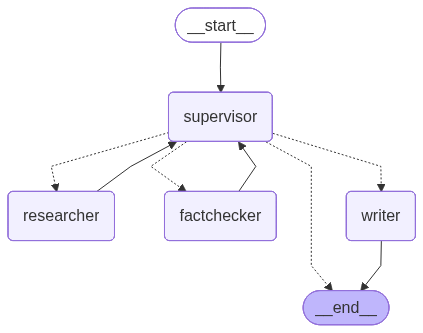

# newsroomAgent

Work-in-progress newsroom research assistant. Multi-agent LangGraph pipeline (researcher, fact-checker, writer), RAG over a news corpus, custom MCP server.

## What it does

Ingests a curated folder of news articles into a local vector store, then answers questions about them with citations back to the original files. Topics outside the archive return limited results. The retrieval is exposed through a FastAPI endpoint and an MCP server, so it can be driven from a browser, curl, or an MCP-aware agent like Claude.

## Stack

- Python 3.12, uv
- LangChain + LangGraph for the multi-agent pipeline
- Chroma for the vector store, Ollama (`nomic-embed-text`) for embeddings
- Pluggable LLM provider: Anthropic Claude direct API or AWS Bedrock (tied to `MODEL_PROVIDER` env var)
- LangSmith for trace + cost + latency observability
- FastAPI for the HTTP layer, FastMCP for the MCP server
- Tavily for live web search

## Architecture

The supervisor graph below is generated directly from the compiled LangGraph (`scripts/draw_graph.py`), so it always reflects the real node and edge topology rather than a hand-drawn approximation:



The `supervisor` is the entry point and the hub. Each turn it checks the current state (research notes, verdicts, rejection rate, step budget) and routes to one of three workers, which all loop back to it. The `researcher` gathers cited facts from the MCP tools, the `factchecker` turns them into structured verdicts, and the `writer` drafts the script. It loops until enough claims are verified, then hands off to the writer. A step budget caps how many passes it gets, and if too few claims are verified it stops without writing a story.

- `newsroomagent/ingest.py` loads `data/raw/*.txt`, chunks with a recursive splitter, embeds, and persists to `data/chroma/`.
- `newsroomagent/retrieval.py` opens the persisted store and runs top-k similarity search, then prompts Claude with a citation-aware template.
- `newsroomagent/mcp_server.py` exposes `archive_search`, `web_search`, and `get_current_time` over stdio so an MCP client can use the archive as a tool.
- `newsroomagent/graph.py` assembles the LangGraph pipeline: a supervisor node routes between researcher, fact checker, and writer workers, capped by a step budget. Researcher gathers notes with citations via the MCP tools, fact-checker emits structured verdicts, writer drafts the final script.
- `main.py` serves a FastAPI app with `/health` and `POST /research`.
- `newsroomagent/api.py` serves a second FastAPI app that runs the full graph and streams each node's progress to the client over Server-Sent Events. It also serves a small browser UI (`newsroomagent/frontend/index.html`) at `/` that consumes that stream and shows live progress plus the final script.

## Observability and provider pluggability

Every run is traced in LangSmith with full hierarchical spans for each agent and tool call. The same graph runs on Anthropic's direct API or AWS Bedrock with a one-line env var change (`MODEL_PROVIDER=bedrock`).


The highlighted span confirms the supervisor swap is routing through Bedrock (`us.anthropic.claude-sonnet-4-6`). Visible in the trace: 82 seconds end-to-end, 54K tokens, $0.23 total cost across all four agent nodes.

## Quickstart

Install dependencies:

```bash
uv sync
```

Build the vector store from `data/raw/*.txt`. Rerun whenever source articles or chunking config changes:

```bash
uv run python -c "from newsroomagent.ingest import ingest; ingest()"
```

### Option 1: LangGraph pipeline
Smoke test of the compiled graph. Spawns the MCP server, hands the supervisor a sample topic, and lets it route between researcher, fact-checker, writer until the script is ready or the step budget is hit. Prints the supervisor's routing trace and the final news script.

```bash
uv run python -m newsroomagent.graph
```

### Option 2: Streaming multi-agent API + browser demo

Runs the full supervisor graph and streams node-by-node progress over SSE.
Requires Ollama running for `archive_search`.

```bash
uv run uvicorn newsroomagent.api:app --reload
```

Then open `http://localhost:8000/` in a browser, enter a topic, and watch the
researcher, fact-checker, and writer report progress live before the final
script appears.

Prefer the raw stream? Hit the endpoint directly with curl in a second terminal


```bash
curl -N -G "http://localhost:8000/stream" \
  --data-urlencode "topic=What elections happened in India in 2026?"
```

### Option 3: Retrieval API (JSON)

```bash
uv run uvicorn main:app --reload
```

Then open `http://127.0.0.1:8000/docs` for Swagger, or:

```bash
curl -X POST http://127.0.0.1:8000/research \
  -H "Content-Type: application/json" \
  -d '{"topic":"What recent elections happened?","k":3}'
```

### Option 4: MCP server

Runs over stdio for use with an MCP client:

```bash
uv run python -m newsroomagent.mcp_server
```

Requires `TAVILY_API_KEY` in the environment for `web_search`.

### Option 5: Retrieval via REPL

```bash
uv run python
```

```python
from newsroomagent.retrieval import retrieve
chunks = retrieve("What election occurred recently?", k=3)
for c in chunks:
    print(c.metadata["source"])
```

## Status

Active development. Working: ingest, retrieval, citation-aware answers, FastAPI endpoint, MCP server with archive + web search, multi-agent supervisor graph (researcher / fact-checker / writer with step budget), pluggable Anthropic/Bedrock provider, LangSmith tracing, per-node streaming both in the CLI and over an SSE HTTP endpoint, and a browser demo UI that visualizes the pipeline live. Next: demo video to be added to the README.
